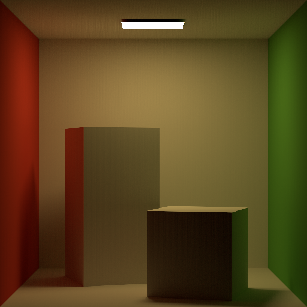
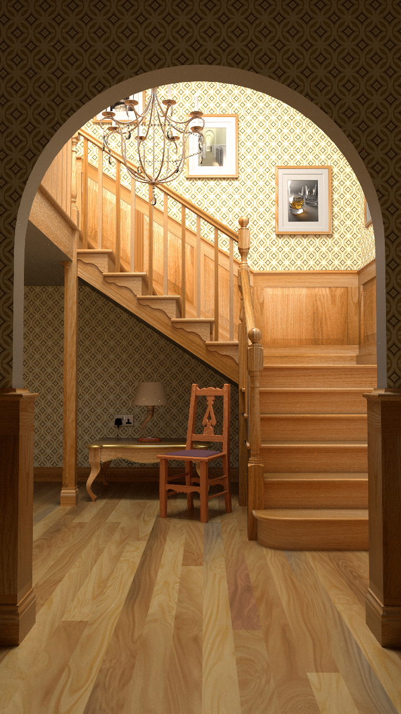
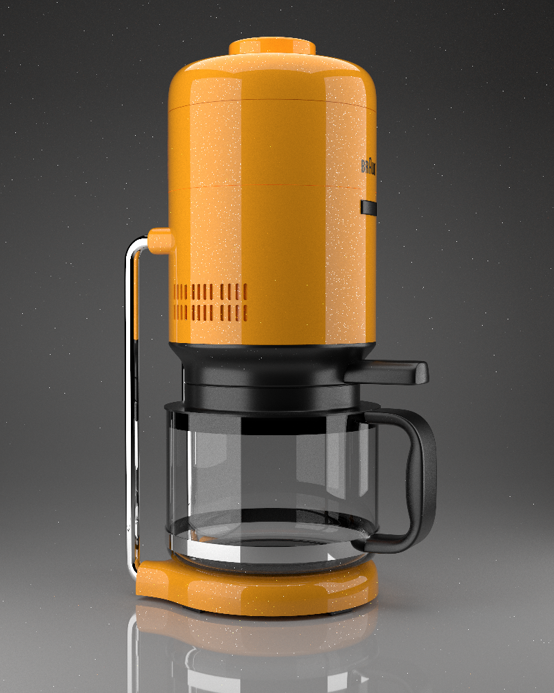
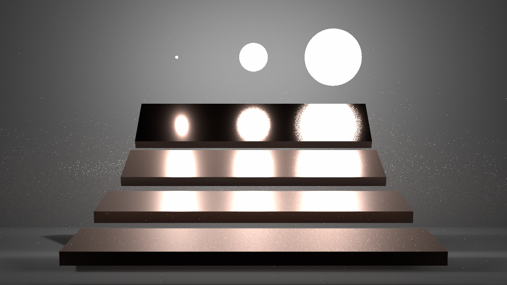

# Cavalry
A GPU Ray Tracer written in CUDA

> Cheers love, the cavalry's here!  -- Tracer (Lena Oxton)

Features:

* GPU Bounding Volume Hierarchy construction using radix trees (Aila 2012)

* GPU BVH Optimization by restructuring (Aila 2013)

* (Partial) compatibility with PBRT v3 scene definition files.

* Reinforcement Learning Guided Path Tracing

## Sample Images

*Cornell Box*

*Living Room*

*Bath Room*

*Staircase*

*Coffee Box*

*Multi-Importance Sampling*