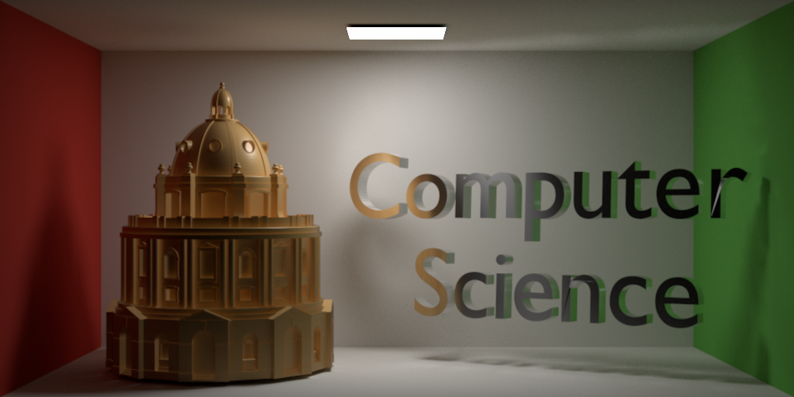
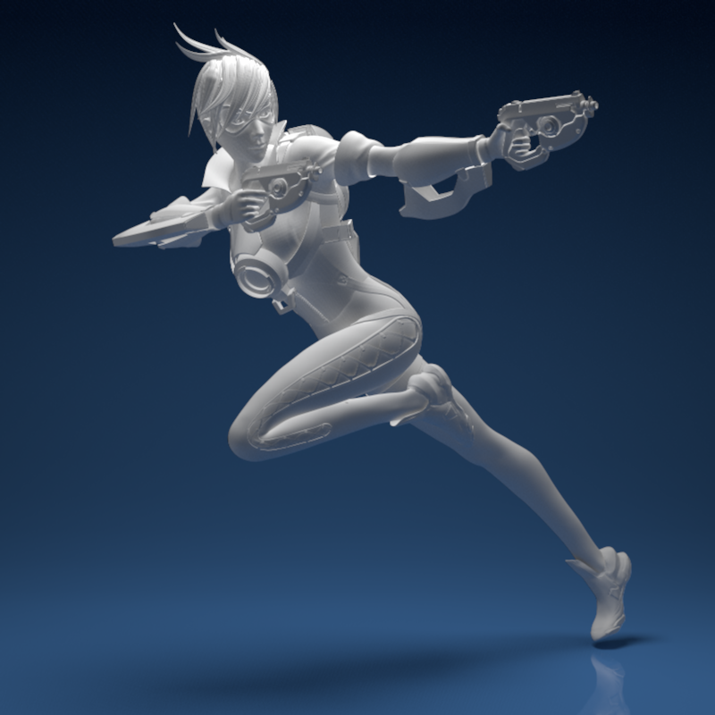

# Cavalry
A GPU Ray Tracer written in CUDA


> Cheers love, the cavalry's here!  -- Tracer (Lena Oxton)

Features:

* GPU Bounding Volume Hierarchy construction using radix trees (Aila 2012)

* GPU BVH Optimization by restructuring (Aila 2013)

* (Partial) compatibility with PBRT v3 scene definition files.

* Reinforcement Learning Guided Path Tracing


This is submitted as my 4th year project at the CS department of the University of Oxford.

## Installation

```
mkdir build
cd build
cmake ..
```
And then `make` or open solutions file using IDE.

For Windows, a pre-built executable is available in `exe/`


## Running Cavalry

```
Cavalry --input <input .pbrt file> 
```

Optional flags: 

* `--output <output .png file>`

* `--spp <amount of samples per pixel>`

* `--integrator <path or rlpath>`

    `path` corresponds to a path-tracing integrator

    `rlpath` corresponds to a reinforcement learning path-tracing integrator

* `--bvh-opt-rounds <amount of BVH optimization rounds>`


## Sample Images





*Lena "Tracer" Oxton.*


Scenes (geometries, materials, textures) credit to [1](https://benedikt-bitterli.me/resources/), [2](ts3d.com/en/3d-model/architecture/radcliffe-camera), and [3](https://sketchfab.com/3d-models/overwatch-tracer-710fc23797ef4ca8847b8ac150cdaf62)